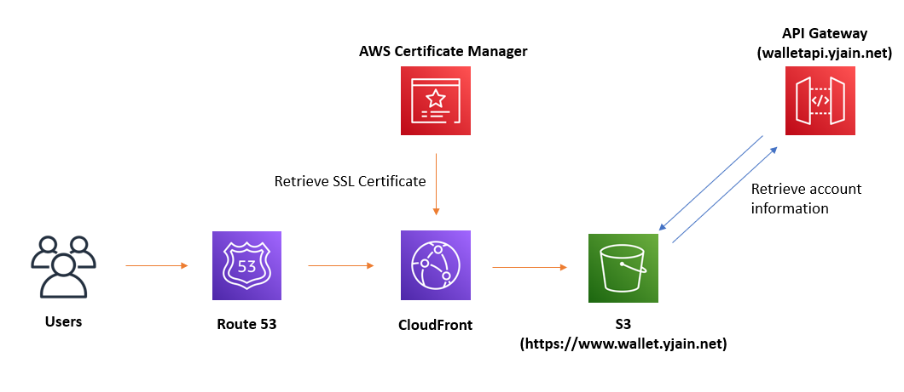
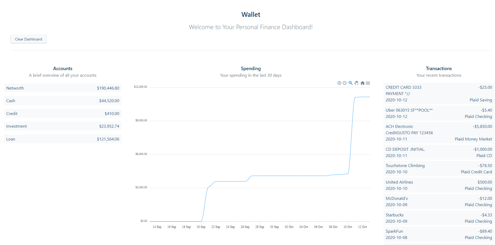

# Wallet

http://www.wallet.yjain.net/

## Overview

This repo contains the frontend and backend code for Wallet. Wallet is a personal finance management application that provides the user with a dashboard containing their account information. Wallet allows users to monitor and budget their personal finances.

**AWS Architecture **



## Usage

It’s as simple as connecting your financial institution to the application using your respective credentials.

For demo purposes, I’ve temporarily severed the application with a dummy account that can be logged in using the following credentials (by selecting any financial institution), and allows you to experience the functionality of the application:

```
Username: user_good
Password: pass_good

````
## Demo

A visualization of the dashboard itself, displaying a dummy account

